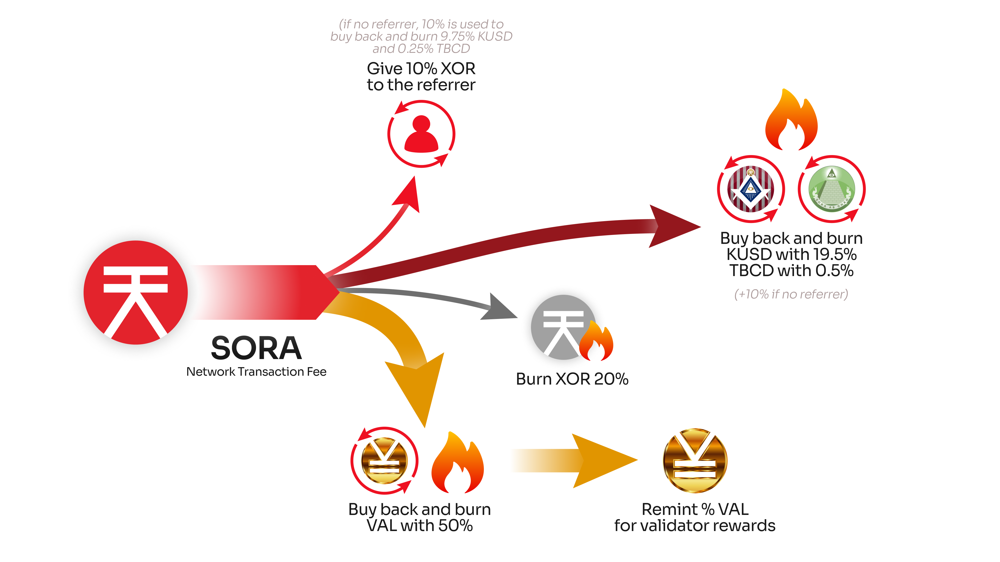

# Kensetsu Token Overview

Kensetsu USD (KUSD) is an over-collateralized stablecoin within the SORA ecosystem, pegged to the US Dollar (USD). Built on the Kensetsu Platform, KUSD facilitates secure borrowing operations while maintaining its value through robust stability mechanisms. The platform is inspired by MakerDAO and is designed as a decentralized finance (DeFi) solution on SORA, offering a fast, efficient, and user-driven environment.

Through its innovative design, the Kensetsu Platform aims to bridge the gap between digital and physical economies by partially backing pegged assets like KUSD with labour, creating real-world value connections.

## How to Get KUSD

1. Create a Vault: To borrow KUSD, users must first create a Vault on the Kensetsu platform.

- Step 1: Deposit supported collateral tokens, such as XOR, VAL, PSWAP, TBCD, ETH, or DAI.
- Step 2: Ensure sufficient collateralization, adhering to the platform’s Loan-to-Value (LTV) ratio requirements.

2. Deposit Collateral

- Add collateral to your Vault to increase its security and borrowing capacity.
- A higher collateral amount reduces the LTV ratio and safeguards against liquidation.

3. Borrow KUSD

- Borrow KUSD tokens, pegged to USD, against the value of your collateral.
- The amount available depends on the collateral value and platform parameters, such as the stability fee and borrow tax (1%).

4. Manage Your Vault

- Regularly monitor your Vault to ensure the collateral value remains above the liquidation threshold.
- Add more collateral or repay debt to maintain a healthy LTV ratio and avoid liquidation penalties.

5. Repay Debt and Close Vault

- To repay borrowed KUSD, ensure you have sufficient tokens to cover the debt and fees.
- Once the debt is cleared, you can close the Vault and reclaim your collateral.

Please check [Kensetsu Platform page](kensetsu-vaults.md) to find more details about the process to receive KUSD.

## Support KUSD

The Kensetsu USD was implemented in the Token Bonding Curve of Tokenomics to support the peg to USD in SORA blockchain. Please see more details about the margin on [this page](tbc.md).

Also, to stabilise the price of Kensetsu, 19.5% of all transactions within the SORA network will be allocated for the buyback and burning of KUSD, 0.5% for the buyback and burning of TBCD, 10% for referral rewards for newcomers, 20% for burning XOR, and 50% for the buyback and burning of VAL.

## In Summary

Kensetsu USD (KUSD) represents a vital innovation in the SORA ecosystem, offering a decentralized and efficient stablecoin solution. Through over-collateralization, dynamic governance, and community-driven incentives, KUSD establishes a robust framework for borrowing pegged assets while ensuring economic stability.

The platform not only aligns with global DeFi standards but also introduces new paradigms by tying digital assets to real-world labour, paving the way for a truly interconnected economy. Kensetsu empowers users with advanced tools for stablecoin borrowing and sets the stage for future expansions with assets like KAU and the inclusion of the KEN rewards token.

## Learn More

- [SORA Tokenomics](tokenomics.md)
- [Kensetsu Platform page](kensetsu-vaults.md)
- [Token Bonding Curve](tbc.md)
