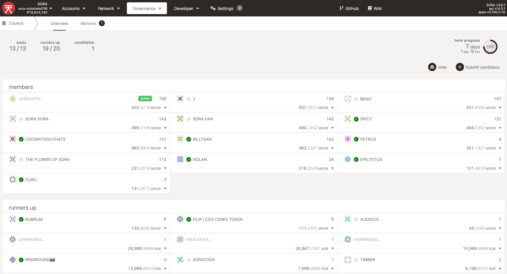
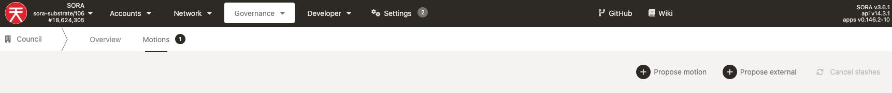
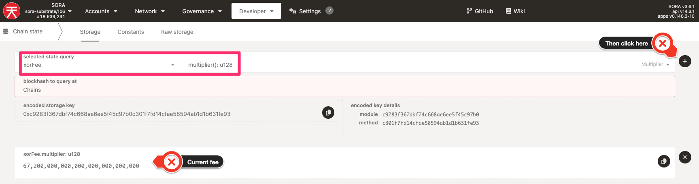
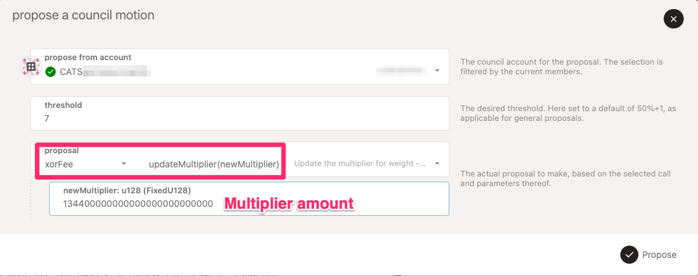
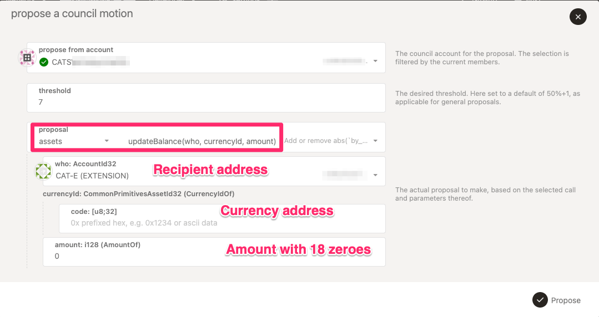
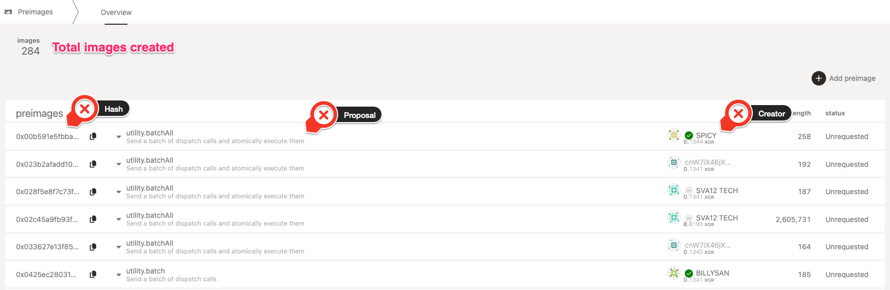
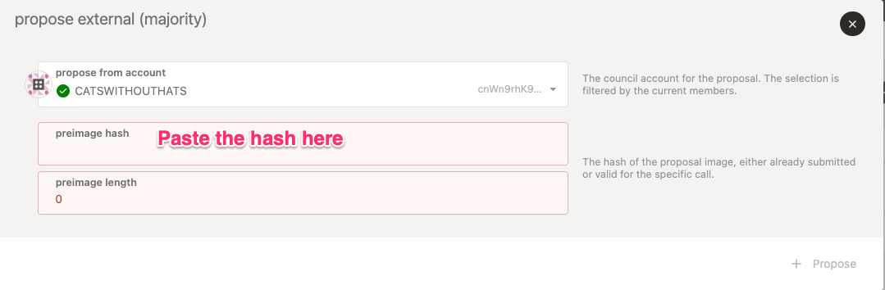

# SORA Governance

SORA governance is still in development. The current version uses
[Polkadot v1
Governance](https://wiki.polkadot.network/docs/learn/learn-governance).

::: info
To vote in SORA governance proposals, follow the [SORA Governance
Tutorial](participate-sora-governance.md).
:::

The SORA Parliament is the governance system for the SORA network, its main task is to allocate newly minted XOR to **productive projects**. By combining decentralized governance and capital allocation, the SORA Parliament can create a digital government that can work to make our world, and other worlds better, without intruding on individual liberties.

The SORA Parliament utilizes **Supranational Global Governance**. This method has clear separation between propositioning, decision making, and rule making. There is no president or prime minister in this system, rather the rules of the system itself are the leader and all participants collaborate together as equal peers, making and reviewing proposals. It will have multiple bodies with a clear separation of powers and where the members (Citizens) are chosen randomly. It is built around these three main concepts, the same that grounded democracy in Athens:

- **Isonomia**: the principle that everyone who is a citizen has political equality
- **Isegoria**: the right of all citizens to speak and contribute
- **Sortition**: randomly choosing groups of citizens to make decisions

Check out [this Medium
article](https://medium.com/sora-xor/the-sora-parliament-af8184dae384)
to find more about the Parliament and the governance bodies.

## Creating a Motion in Governance

As mentioned above, the Polkadot v1 Governance is used and the current
SORA Council uses the Polkadot.JS interface. This section will cover
what the different governance features are and how to create a motion
in SORA v2.

### SORA Council

The SORA council can be found in the Council section of the Governace
drop down menu in
[Polkadot.js](https://polkadot.js.org/apps/#/council). The main
council interface will have the names of current members as well as
runner-up candidates.

#### SORA Council Motions

Governance proposals in SORA begin as council motions. There are two
ways to make a motion, by proposing the motion directly or proposing
an external, by using a [preimage](#preimages) hash that has been created
already.
This tutorial will show you how to make a preimage to
[increase network fees](#increase-network-fees) and [mint
tokens](#mint-tokens). Then, it will cover [submitting the preimage for council vote](#propose-external).

##### Propose Motion

This button allows you to create any governance motion from all the
available options.

::: info
Only an account within the Council members can create a Council
motion. Users can create motions, but it will take 45 days to enact.
:::

###### Increase Network Fees

::: info
The network fee multiplier depends on the current price of XOR. Fees
must be increased to match the set amount of ¢20 per transaction.
:::

To increase SORA network fees;

- Find out what the current network fee is. To do that navigate to the
  Developer tab, then Chain State drop down. For the selected state
  query pick `xorFee`and make sure the multiplier is set to
  `multiplier():u128`. Click on the + sign to query.

  

- Now that we know the current fee multiplier is
  `67,200,000,000,000,000,000,000,000` it is time to make the proposal
  to double the fee.
- Navigate to the Governance tab, the Council, then Motions and click on propose motion, then in the proposal section select
  `xorFee`and from the option choose `updateMultiplier(new
Multiplier)`this will add the option to input a fee multiplier
  amount in numbers. In this case we have added `134400000000000000000000000`as it is double the current fee.

After you click propose, and confirm the transaction, it will generate
a [preimage](#preimages). You need this to create your motion.

###### Mint Tokens

In this case, the motion to be proposed is to mint an amount of tokens
to a given address. To do that;

- Click on propose motion, then in the
  proposal section select `assets` and from the option section choose
  `updateBalance`this will add the option to add an address from your
  address book or you can input the address manually.

- Then add the currency ID (you can find this in Polkaswap within the
  [Explore Tokens section](https://polkaswap.io/#/explore/token).

- Finally, add the amount in 10^18 precision of tokens to be sent (the number of tokens followed by 18 zeroes).

After you click propose, and confirm the transaction, it will generate
a [preimage](#preimages). You need this to create your motion.

###### Preimages

These are proposal drafts that have not been requested to
governance. After following the above steps, you will find your
proposal among the list within the Preimage section of the Governance
drop dowm menu in
[Polkadot.js](https://polkadot.js.org/apps/#/preimages)

:::info
Anyone can create a preimage from the [preimage](https://polkadot.js.org/apps/#/preimages). section, but you
cannot propose it in the Council.
:::

##### Propose External

Now that you have your preimage, copy the hash and back in the Motions
subsection of the Council option in the Governance dropdown in
[Polkadot.js](https://polkadot.js.org/apps/#/council) select Propose
External.

The pop up will ask you for the preimage hash and length. Paste the
hash and the length will populate automatically. Click propose and
confirm the transaction. Congratulations, you have created a Council
Motion.

All that is left is for the Council to vote on it, then, if approved
it will become a Democracy Referenda that the entire community can
vote on. **This is the first step to governance!**

## Learn More

- [XOR](/xor.md)
- [Request Features on SORA](/rfp.md)
